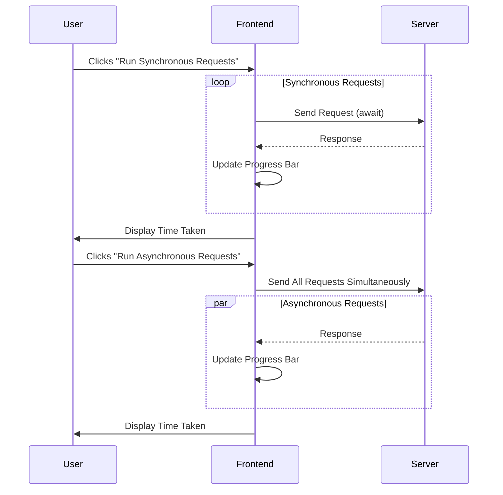
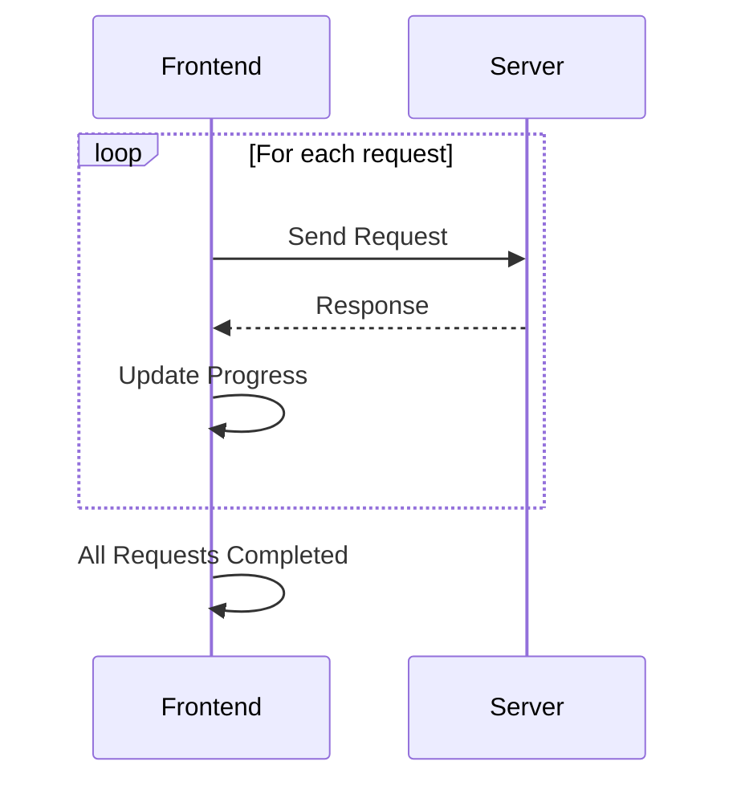
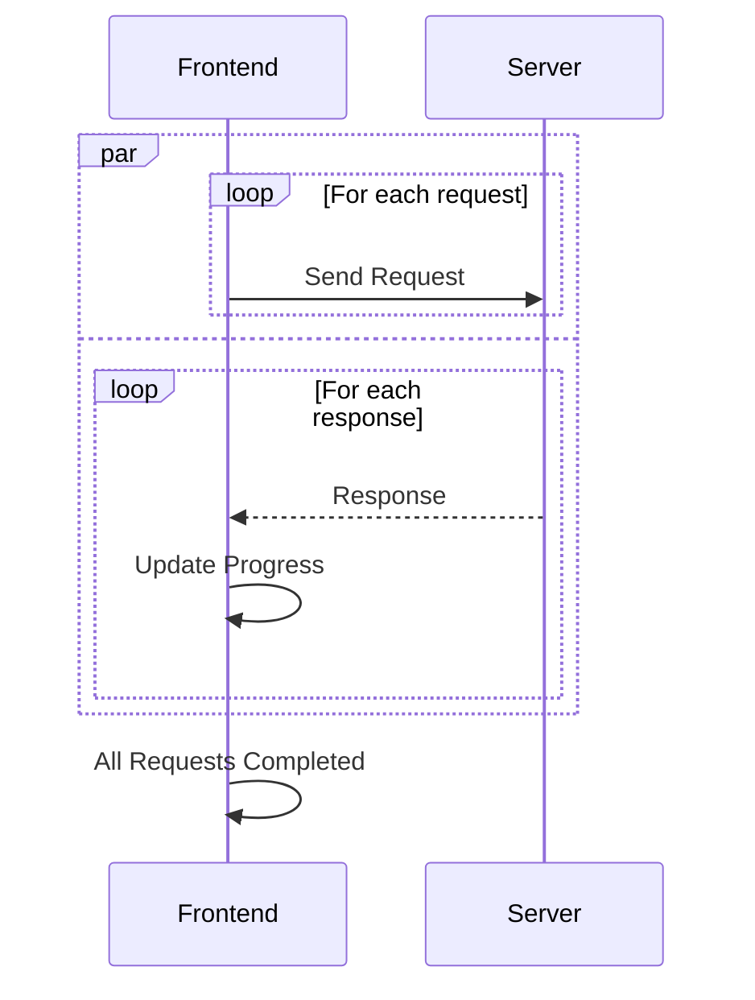
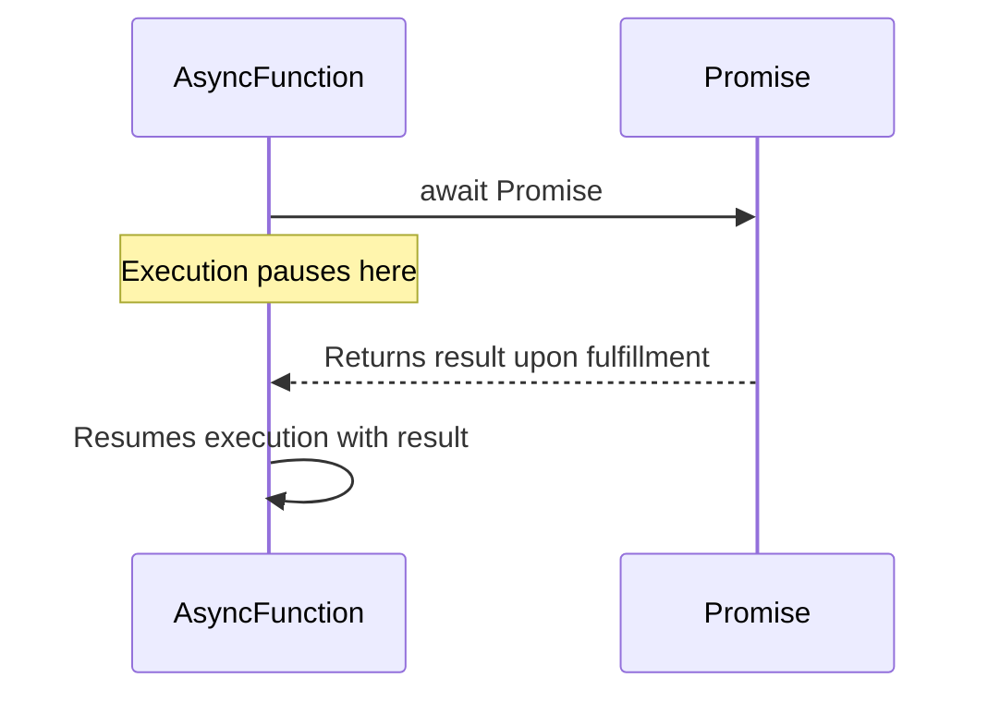
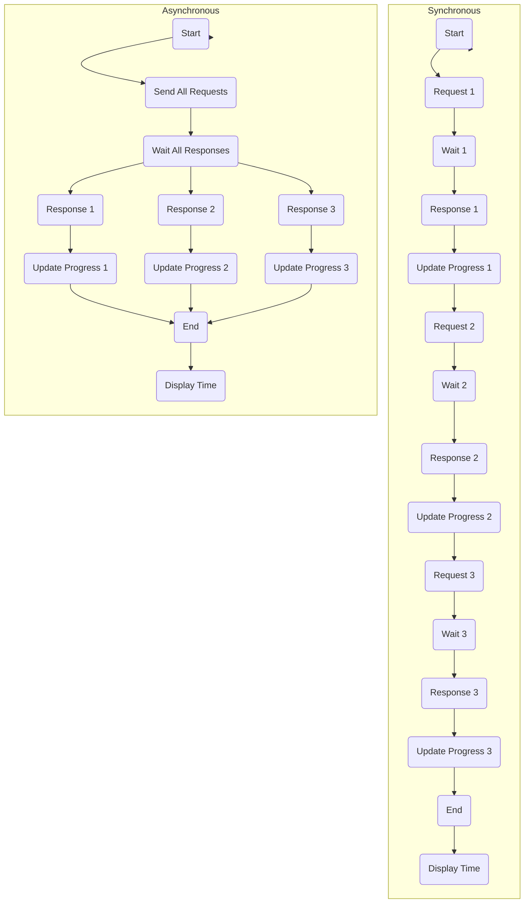

# Async await document

## Application flow



## How it works

### Synchronous case

Use await to wait for each request to complete, then execute the next request in turn.

```typescript
for (let i = 0; i < TOTAL_REQUESTS; i++) {
   try {
    await axios.get(API_URL);
    setSyncProgress(((i + 1) / TOTAL_REQUESTS) * 100);
```



### Asynchronous case

Multiple requests are stored in an array of Promise and executed and waited for simultaneously with Promise.all().

```typescript
  const requests = [];
  for (let i = 0; i < TOTAL_REQUESTS; i++) {
   requests.push(
    axios
     .get(API_URL)
     .then(() => {
      setAsyncProgress((prev) => prev + 100 / TOTAL_REQUESTS);
```



## Await

Once the Promise is fulfilled, execution resumes with the resolved value.
If the Promise is rejected, an exception is thrown.

```typescript
async function fetchData() {
  try {
    const response = await fetch("https://api.example.com/data");
    const data = await response.json();
    return data;
  } catch (error) {
    console.error("Error:", error);
  }
}
```



## Performance


